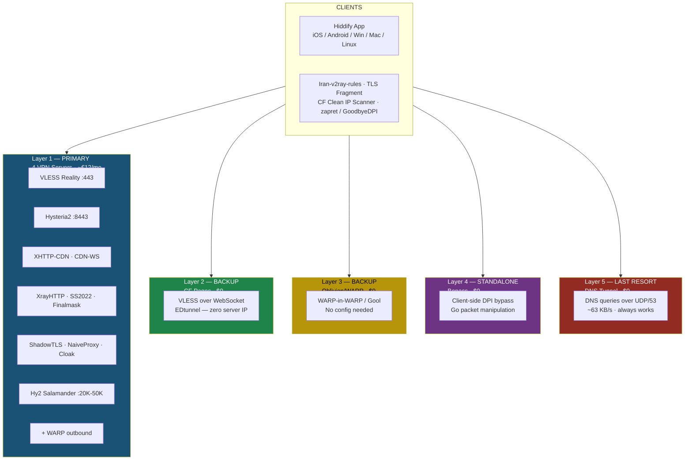
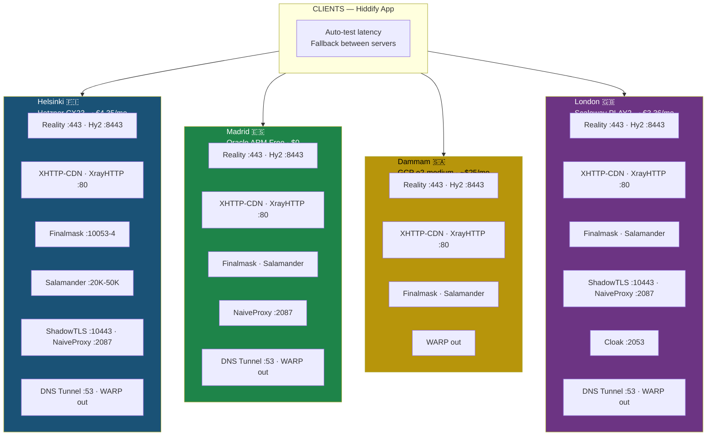
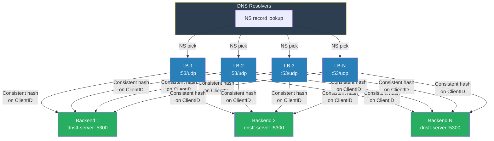

# Architecture Overview

## Design Principles

1. **Layered defense**: Multiple independent paths to the internet
2. **Protocol diversity**: If one protocol is blocked, others survive
3. **Undetectable by default**: Primary protocol (VLESS Reality) is indistinguishable from normal HTTPS
4. **Serverless backup**: Cloudflare Pages layer requires no VPS at all
5. **Split routing**: Iranian domestic traffic goes direct, only international through VPN
6. **Multi-transport coverage**: TCP, UDP, CDN, DNS, and QUIC paths ensure at least one works

## Protocol Inventory (v5.9)

| Protocol | Transport | Port | Servers | DPI Risk | Block Bypass |
|---|---|---|---|---|---|
| VLESS + Reality | TCP/443 | 443 | All 4 | Near zero | Mimics real TLS to Google/MS |
| Hysteria2 | QUIC/UDP | 8443 | All 4 | Low | Self-signed cert, fast |
| Hy2 Salamander+Hop | UDP | 20000-50000 | All 4 | Very low | Obfuscated QUIC + port cycling |
| XHTTP-CDN | HTTPS | 443 | All 4 | Near zero | Pure HTTP via Cloudflare CDN |
| CDN-WS | WSS/443 | 443 | All 4 | Low | WebSocket via Cloudflare CDN |
| XrayHTTP | TCP/80 | 80 | All 4 | Low | Fake HTTP to whitelisted domain |
| SS2022 | TCP/80 | 80 | All 4 | Near zero | Random encrypted bytes |
| Finalmask XDNS | UDP/mKCP | 10053 | All 4 | Very low | Looks like DNS queries |
| Finalmask XICMP | UDP/mKCP | 10054 | All 4 | Very low | Looks like game/P2P traffic |
| ShadowTLS v3 | TCP/TLS | 10443 | All 4 | Near zero | Real TLS handshake to Google |
| NaiveProxy | HTTPS | 2087 | HEL, ORC, SCW | Near zero | Chrome's actual TLS stack |
| Cloak+SS2022 | TCP/TLS | 2053 | SCW only | Near zero | Genuine TLS wrapper |
| DNS Tunnel | DNS/UDP | 53 | HEL, ORC, SCW | Near zero | Uses DNS protocol |
| MTProto | TCP | 443 | All 4 | Near zero | Telegram-native proxy |
| EDtunnel | WSS/443 | 443 | CF Pages | Near zero | Zero server IP exposure |

## Infrastructure Layers



<details>
<summary>ASCII version (legacy)</summary>

```text
┌──────────────────────────────────────────────────────────────────────┐
│                           CLIENTS                                     │
│  Hiddify App (iOS/Android/Win/Mac/Linux)                             │
│  + Iran-v2ray-rules (split routing)                                  │
│  + TLS Fragment (Length: 10-100, Interval: 10-50)                    │
│  + CF Clean IP Scanner (find fastest Cloudflare edge IPs)            │
│  + zapret/GoodbyeDPI (client-side DPI bypass)                        │
└───┬──────────┬──────────┬──────────┬──────────┬──────────────────────┘
    │          │          │          │          │
┌───▼────┐┌───▼────┐┌────▼───┐┌────▼─────┐┌───▼──────────┐
│Layer 1 ││Layer 2 ││Layer 3 ││Layer 4   ││Layer 5       │
│PRIMARY ││BACKUP  ││BACKUP  ││STANDALONE││LAST RESORT   │
│        ││        ││        ││          ││              │
│Hetzner ││CF      ││Obliv-  ││Bepass    ││DNS Tunnel    │
│Cloud   ││Pages   ││ion/    ││DPI       ││(dnstt)       │
│        ││(EDtun) ││WARP    ││Bypass    ││              │
│┌──────┐││┌──────┐││┌──────┐││┌────────┐││┌────────────┐│
││VLESS ││││VLESS ││││WARP  ││││Go DPI  ││││DNS queries ││
││Reality│││over  ││││in    ││││bypass  ││││over UDP/53 ││
││(443) ││││WS    ││││WARP  ││││tool    ││││             ││
│├──────┤│││      ││││(WiW) ││││        ││││Uses domain: ││
││Hyst. ││││      ││││      ││││        ││││<DOMAIN>     ││
││2     ││││      ││││Gool  ││││        ││││             ││
││(8443)││││      ││││mode  ││││        ││││             ││
│└──────┘││└──────┘││└──────┘││└────────┘││└────────────┘│
│        ││        ││        ││          ││              │
│+ WARP  ││FREE    ││FREE    ││FREE      ││              │
│outbound││No VPS  ││No VPS  ││No VPS    ││              │
│(warp-  ││needed  ││needed  ││needed    ││              │
│ yg)    ││        ││        ││          ││              │
└────────┘└────────┘└────────┘└──────────┘└──────────────┘
  ~€12/mo     $0        $0        $0         $0 (same VPS)
  (4 servers)
```

</details>

### Fallback Priority (v5.9 — for users in Iran)

> **Multi-CDN**: Configs use Cloudflare, Vercel relay, and Netlify relay for CDN diversity.  
> **ISP-aware**: Iran users on MCI, Irancell, or Rightel get tuned TLS fragment + MUX padding profiles.  
> **Backup sub**: `sub.example.net` (Vercel Edge) mirrors all ~190 configs if primary goes down.

1. **XHTTP-CDN** → Best combo: CDN-fronted + no WS headers + anti-detection
2. **XHTTP-CDN + Clean CF IPs** → When default CF IPs are throttled per ISP
3. **Finalmask XDNS/XICMP** → UDP-based, looks like DNS/game traffic, works when TCP blocked
4. **XrayHTTP** → Direct TCP with fake HTTP headers to whitelisted domains
5. **VLESS Reality** → Direct TLS to Google-mimicking, fastest throughput
6. **Hysteria2** → UDP/QUIC, fast, bypasses TCP-focused DPI
7. **Hy2 Salamander+Hop** → Obfuscated QUIC + port cycling (20K-50K UDP range)
8. **ShadowTLS v3** → Real TLS handshake to Google + inner SS2022 tunnel
9. **IPv6 Reality/Hy2** → When ISP blocks IPv4 only
10. **CDN-WS** → CDN-fronted but WS detectable
11. **SS2022, NaiveProxy, Cloak** → Plan B diverse protocols
12. **DNS Tunnel (dnstm)** → Emergency, always works, slow (~63 KB/s)
13. **EDtunnel (CF Pages)** → Zero server IP exposure, ultimate fallback

## Multi-Server Topology



<details>
<summary>ASCII version (legacy)</summary>

```text
                              ┌──────────────┐
                              │   CLIENTS    │
                              │  (Hiddify)   │
                              └──┬──┬──┬──┬──┘
                                 │  │  │  │
           ┌─────────────────────┘  │  │  └─────────────────────┐
           │           ┌────────────┘  └────────────┐           │
┌──────────▼────────┐ ┌▼────────────────┐ ┌─────────▼────────┐ ┌▼──────────────────┐
│  Helsinki (FI)    │ │ Oracle Madrid   │ │ GCP Dammam (SA)  │ │ Scaleway London   │
│  Hetzner CX23    │ │ ARM Free Tier   │ │ e2-medium        │ │ PLAY2-PICO        │
│  ~€4.35/mo       │ │ $0 (free)       │ │ ~$25/mo (credit) │ │ ~€3.36/mo         │
│                   │ │                 │ │                  │ │                   │
│ Reality     443   │ │ Reality    443  │ │ Reality    443   │ │ Reality     443   │
│ Hy2        8443   │ │ Hy2       8443  │ │ Hy2       8443   │ │ Hy2        8443   │
│ XHTTP-CDN   80   │ │ XHTTP-CDN  80  │ │ XHTTP-CDN   80  │ │ XHTTP-CDN    80  │
│ XrayHTTP    80    │ │ XrayHTTP   80   │ │ XrayHTTP    80   │ │ XrayHTTP     80   │
│ Finalmask 10053-4 │ │ Finalmask      │ │ Finalmask        │ │ Finalmask         │
│ Salamander 20K-50K│ │ Salamander     │ │ Salamander       │ │ Salamander        │
│ ShadowTLS  10443  │ │ ShadowTLS 10443│ │ ShadowTLS  10443 │ │ ShadowTLS  10443  │
│ NaiveProxy  2087  │ │ NaiveProxy 2087│ │                  │ │ NaiveProxy  2087  │
│ DNS tun      53   │ │ DNS tun    53  │ │ + WARP out       │ │ Cloak       2053  │
│ + WARP out        │ │ + WARP out     │ │                  │ │ DNS tun       53  │
└───────────────────┘ └────────────────┘ └──────────────────┘ │ + WARP out        │
                                                               └───────────────────┘
```

</details>

- Same UUID authenticates on all servers
- Per-server Reality keys, Hy2 certs, WARP identities
- Hiddify auto-tests latency and falls back between servers
- DNS tunnels on Helsinki, Oracle Madrid, and Scaleway London
- See [multi-server.md](./multi-server.md) for full details

## Component Details

### Layer 1: Hetzner Cloud VPS (Primary — Helsinki)

| Component | Details |
|---|---|
| **Provider** | Hetzner Cloud (hetzner.com) |
| **Location** | Finland (Helsinki - hel1) |
| **OS** | Ubuntu 24.04 LTS |
| **Plan** | CX23 ~€4.35/mo (2 vCPU, 4GB RAM, 40GB SSD, 20TB BW) |
| **Server IP** | `<SERVER_IP>` / `<SERVER_IPV6>` |
| **Deployment** | Docker Compose via reality-ezpz (sing-box 1.12.14) |
| **Management** | CLI + TUI + Telegram Bot |

**Protocols:**

| Protocol | Port | Transport | Detection Risk |
|---|---|---|---|
| VLESS + Reality | 443/tcp | TCP | Virtually undetectable - borrows TLS from real site (SNI: `www.google.com`) |
| Hysteria2 | 8443/udp | QUIC/UDP | Low - self-signed cert (CN: <www.google.com>) |

**Why VLESS Reality is the gold standard:**

- No domain or SSL certificate needed
- Server impersonates a real website's TLS handshake (e.g. <www.microsoft.com>)
- DPI sees traffic identical to visiting google.com
- Can't be blocked without blocking google.com itself
- No SNI to target, no certificate to revoke

### Layer 1b: Additional Exit Servers

| # | Location | Provider | Plan | Cost | Stack | DNS Tunnels | Status |
|---|---|---|---|---|---|---|---|
| 2 | Madrid, ES | Oracle Cloud | A1.Flex (Free) | $0 | Reality + Hy2 + WARP + ShadowTLS + NaiveProxy | Yes (dnstt on t2.) | Active |
| 3 | Dammam, SA | Google Cloud | e2-medium ($300 credit) | ~$25/mo (free 90 days) | Reality + Hy2 + WARP + ShadowTLS | No | Active |
| 4 | London, UK | Scaleway | PLAY2-PICO | ~€3.36/mo | Reality + Hy2 + WARP + NaiveProxy + Cloak + ShadowTLS | Yes (dnstt on s2.) | Active |

**Why multiple exit servers?**

- IP block rotation: when one provider's IPs are blocked, others survive
- ASN diversity: different hosting provider = different block patterns
- Latency diversity: regional differences improve speed for some ISPs
- Protocol diversity: NaiveProxy on 3, Cloak on Scaleway, ShadowTLS on all 4

### Layer 2: Cloudflare Pages (EDtunnel)

| Component | Details |
|---|---|
| **Service** | Cloudflare Pages (free tier) — Workers has cloudflare:sockets bug |
| **Cost** | Free (100k requests/day) |
| **Protocol** | VLESS + Trojan over WebSocket |
| **Production URL** | `<CF_PAGES_URL>` |
| **Our fork** | Your own GitHub fork (use an innocent project name) |
| **Upstream repo** | <https://github.com/6Kmfi6HP/EDtunnel> |
| **Block risk** | Near zero - would require blocking all Cloudflare |
| **Known issue** | Workers deployment fails (Error 1101 on `cloudflare:sockets`); use Pages |

### Layer 5: DNS Tunnel (dnstm)

| Component | Details |
|---|---|
| **Runs on** | Helsinki, Oracle Madrid, Scaleway London |
| **Tool** | dnstm v0.6.7+ (DNS Tunnel Manager) — multi-tunnel mode |
| **Tunnels (HEL)** | 3 active: Slipstream+SOCKS (t.), DNSTT+SOCKS (t2.), Slipstream+SSH (s2.) |
| **Tunnels (ORC)** | DNSTT+SOCKS (t2.) via tns2 nameserver |
| **Tunnels (SCW)** | DNSTT+SOCKS (s2.) via tns4 nameserver |
| **DNS Router** | Listens on port 53, routes queries to correct tunnel |
| **SOCKS proxy** | microsocks on 127.0.0.1:39190 |
| **Domain** | `<DOMAIN>` (NS delegations for t, t2, s2 subdomains) |
| **NS servers** | tns (HEL), tns2 (Oracle), tns4 (Scaleway) |
| **Server repo** | <https://github.com/net2share/dnstm> |
| **Client (desktop)** | <https://github.com/nickoala/dnstc> |
| **Client (Android)** | <https://github.com/nickoala/SlipNet> |
| **Speed** | ~63 KB/s (Slipstream), ~42 KB/s (DNSTT) |
| **Block risk** | Near zero - would require breaking DNS |
| **Use case** | Emergency fallback only |
| **dns-tun-lb** | v0.1.0, built from source, systemd service on `127.0.0.1:5354` (standby) |
| **LB config** | `/opt/dns-tun-lb/lb.yaml` — dnstt-socks pool → `127.0.0.1:5311` |
| **LB activation** | `/opt/dns-tun-lb/activate-lb.sh [activate\|deactivate\|status]` |

### Layer 3: Oblivion / Cloudflare WARP (No Server Needed)

| Component | Details |
|---|---|
| **Apps** | Oblivion Desktop (Win/Mac/Linux), Oblivion (Android) |
| **Cost** | Free |
| **How it works** | Connects via Cloudflare WARP with Warp-in-Warp (WiW) or Gool mode to bypass WARP blocks |
| **Block risk** | Low - uses Cloudflare infrastructure |
| **Use case** | Standalone backup for non-technical users, no config needed |
| **Desktop repo** | <https://github.com/bepass-org/oblivion-desktop> |
| **Android repo** | <https://github.com/bepass-org/oblivion> |

### Layer 4: Bepass DPI Bypass (No Server Needed)

| Component | Details |
|---|---|
| **Tool** | bepass - Go-based DPI bypass |
| **Cost** | Free |
| **How it works** | Manipulates packets client-side to confuse DPI systems |
| **Repo** | <https://github.com/bepass-org/bepass> |
| **CF Worker variant** | <https://github.com/bepass-org/bepass-worker> |

### Client Side

| Component | Platform | Purpose |
|---|---|---|
| **Hiddify App** | iOS, Android, Win, Mac, Linux | Primary client, auto-fallback between protocols |
| **Oblivion** | Android, Win, Mac, Linux | Standalone WARP client, no config needed |
| **Iran-v2ray-rules** | All (integrated in client) | Split routing: domestic direct, international via VPN |
| **TLS Fragment** | All (client setting) | Fragments TLS handshake to evade DPI |
| **CF Clean IP Scanner** | All | Finds fastest unblocked Cloudflare edge IPs |
| **zapret** | Linux, OpenWrt | Client-side DPI bypass |
| **GoodbyeDPI** | Windows | Client-side DPI bypass |

## Domain & DNS Configuration

### Domain Registration

| Detail | Value |
|---|---|
| **Registrar** | [Porkbun](https://porkbun.com) |
| **Domain** | `<DOMAIN>` |
| **Nameservers** | Delegated to Cloudflare |

### Dynamic DNS (Duck DNS)

| Detail | Value |
|---|---|
| **Service** | [Duck DNS](https://www.duckdns.org) |
| **Subdomain** | `<DUCKDNS_SUBDOMAIN>.duckdns.org` → `<SERVER_IP>` |
| **Token** | `<DUCKDNS_TOKEN>` |
| **Purpose** | Dynamic DNS fallback if domain is blocked; auto-updates server IP |

### Cloudflare DNS Records (Active)

| Record Type | Name | Value | Proxy Status | Purpose |
|---|---|---|---|---|
| A | `<DOMAIN>` | `<SERVER_IP>` | DNS only | Root domain |
| AAAA | `<DOMAIN>` | `<SERVER_IPV6>` | DNS only | Root domain (IPv6) |
| A | tns | `<SERVER_IP>` | DNS only | DNS tunnel nameserver (Helsinki) |
| AAAA | tns | `<SERVER_IPV6>` | DNS only | DNS tunnel nameserver (Helsinki, IPv6) |
| A | tns2 | `<ORC_IP>` | DNS only | DNS tunnel nameserver (Oracle Madrid) |
| A | tns4 | `<SCW_IP>` | DNS only | DNS tunnel nameserver (Scaleway London) |
| NS | t | `tns.<DOMAIN>` | DNS only | Slipstream+SOCKS tunnel (Helsinki) |
| NS | t2 | `tns2.<DOMAIN>` | DNS only | DNSTT+SOCKS tunnel (Oracle Madrid) |
| NS | s2 | `tns4.<DOMAIN>` | DNS only | DNSTT+SOCKS tunnel (Scaleway London) |
| A | cdn | `<HEL_IP>` | Proxied | CDN-WS + XHTTP-CDN (Helsinki) |
| A | cdn2 | `<ORC_IP>` | Proxied | CDN-WS + XHTTP-CDN (Oracle) |
| A | cdn3 | `<SCW_IP>` | Proxied | CDN-WS + XHTTP-CDN (Scaleway) |
| A | cdn4 | `<GCP_IP>` | Proxied | CDN-WS + XHTTP-CDN (GCP) |
| CNAME | sub | `your-pages-project.pages.dev` | Proxied | Smart subscription worker (CF Pages, was your-pages-project before CF abuse block) |
| A | web | `<HEL_IP>` | DNS only | NaiveProxy (Helsinki) |
| A | web2 | `<ORC_IP>` | DNS only | NaiveProxy (Oracle Madrid) |
| A | web4 | `<SCW_IP>` | DNS only | NaiveProxy (Scaleway London) |

> **Note**: NS/A records for DNS tunnels MUST be "DNS only" (grey cloud). CDN records MUST be "Proxied" (orange cloud). NaiveProxy A records must be DNS only (grey) for direct TLS.

### Porkbun DNS Records (Inactive — overridden by Cloudflare NS)

These records exist in Porkbun but are NOT active since nameservers point to Cloudflare.
These can be ignored or cleaned up.

## Security Model

- SSH key-only authentication
- UFW firewall (only required ports open)
- fail2ban on SSH
- No logging of user traffic
- Automated daily backups (`/opt/vpn-backups/`, 7-day rotation, cron at 2 AM UTC)
- Automatic security updates
- SSH tunnel user restricted (nologin shell, sshtunnel-password group) via `sshtun-user`

## Key Repos

### Server-Side

| Repo | Stars | Purpose |
|---|---|---|
| [aleskxyz/reality-ezpz](https://github.com/aleskxyz/reality-ezpz) | 1.5k | Main deployment (Docker Compose) |
| [yonggekkk/warp-yg](https://github.com/yonggekkk/warp-yg) | 4.4k | WARP outbound reference (actual: sing-box WireGuard endpoint) |
| Your EDtunnel fork | fork | EDtunnel fork deployed via CF Pages (use innocent name) |
| [6Kmfi6HP/EDtunnel](https://github.com/6Kmfi6HP/EDtunnel) | 2.7k | Upstream EDtunnel project |
| [net2share/dnstm](https://github.com/net2share/dnstm) | - | DNS Tunnel Manager (multi-tunnel, DNS router) |
| [aleskxyz/dns-tun-lb](https://github.com/aleskxyz/dns-tun-lb) | 24 | DNS tunnel load balancer (scales dnstt across multiple backends) |
| [nickoala/dnstc](https://github.com/nickoala/dnstc) | - | DNS tunnel client (desktop) |
| [MHSanaei/3x-ui](https://github.com/MHSanaei/3x-ui) | 31k | Alternative web panel (if reality-ezpz insufficient) |
| [XTLS/Xray-core](https://github.com/XTLS/Xray-core) | 35k | Core engine behind Reality |

### Client-Side

| Repo | Stars | Purpose |
|---|---|---|
| [hiddify/hiddify-app](https://github.com/hiddify/hiddify-app) | 27k | Primary client app (all platforms) |
| [bepass-org/oblivion-desktop](https://github.com/bepass-org/oblivion-desktop) | 8.2k | Cloudflare WARP client (Win/Mac/Linux) - no server needed |
| [bepass-org/oblivion](https://github.com/bepass-org/oblivion) | 4.7k | Cloudflare WARP client (Android) - no server needed |
| [nickoala/SlipNet](https://github.com/nickoala/SlipNet) | - | DNS tunnel client (Android, Slipstream) |
| [bepass-org/bepass](https://github.com/bepass-org/bepass) | 393 | Go DPI bypass tool for Iran |
| [Chocolate4U/Iran-v2ray-rules](https://github.com/Chocolate4U/Iran-v2ray-rules) | 570 | Iran split routing rules |
| [m-rambod/CFScanner](https://github.com/m-rambod/CFScanner) | 12 | Find clean Cloudflare IPs from Iran |

## Scaling: DNS Tunnel Load Balancer (dns-tun-lb)

For high-availability or large-scale DNS tunnel deployments, **dns-tun-lb** distributes dnstt traffic across multiple backend servers using a stateless consistent-hash approach.

### How It Works



<details>
<summary>ASCII version (legacy)</summary>

```text
┌─────────────────────────────────────────────────────────────┐
│                     DNS Resolvers                           │
│              (8.8.8.8, 1.1.1.1, ISP, etc.)                 │
└───┬──────────┬──────────┬──────────┬────────────────────────┘
    │ NS pick  │ NS pick  │ NS pick  │
┌───▼────┐┌───▼────┐┌───▼────┐┌───▼────┐
│  LB-1  ││  LB-2  ││  LB-3  ││  LB-N  │  ← Multiple NS records
│ :53/udp││ :53/udp││ :53/udp││ :53/udp│     for same subdomain
└───┬────┘└───┬────┘└───┬────┘└───┬────┘
    │         │         │         │
    │   Consistent hash on ClientID    │
    │   (same client → same backend)   │
    │         │         │         │
┌───▼────┐┌───▼────┐┌───▼────┐┌───▼────┐
│Backend1││Backend2││Backend3││BackendN│  ← dnstt-server instances
│ :5300  ││ :5300  ││ :5300  ││ :5300  │
└────────┘└────────┘└────────┘└────────┘
```

</details>

### Key Concepts

| Aspect | Detail |
|---|---|
| **Repo** | [aleskxyz/dns-tun-lb](https://github.com/aleskxyz/dns-tun-lb) (Go, v0.1.0) |
| **Author** | aleskxyz (same author as reality-ezpz) |
| **Protocol** | dnstt currently; slipstream support planned |
| **Stickiness** | Extracts 8-byte `ClientID` from dnstt payload → consistent-hash to same backend |
| **Stateless** | No shared state between LB nodes; same config = same routing decision |
| **DNS setup** | Multiple NS records for tunnel subdomain → resolvers pick random LB |
| **Non-tunnel DNS** | Forward to a resolver (e.g. 9.9.9.9) or drop silently |
| **Max backends** | 32+ per pool |

### Example DNS Records (5 LB nodes)

```dns
; Load balancer A records
tns1.<DOMAIN>.   IN  A     <LB-1-IP>
tns2.<DOMAIN>.   IN  A     <LB-2-IP>
tns3.<DOMAIN>.   IN  A     <LB-3-IP>
tns4.<DOMAIN>.   IN  A     <LB-4-IP>
tns5.<DOMAIN>.   IN  A     <LB-5-IP>

; All LBs serve the tunnel subdomain
t.<DOMAIN>.      IN  NS    tns1.<DOMAIN>.
t.<DOMAIN>.      IN  NS    tns2.<DOMAIN>.
t.<DOMAIN>.      IN  NS    tns3.<DOMAIN>.
t.<DOMAIN>.      IN  NS    tns4.<DOMAIN>.
t.<DOMAIN>.      IN  NS    tns5.<DOMAIN>.
```

### Example LB Config (`lb.yaml`)

```yaml
global:
  listen_address: "0.0.0.0:53"
  default_dns_behavior:
    mode: "forward"
    forward_resolver: "9.9.9.9:53"

protocols:
  dnstt:
    pools:
      - name: "dnstt-main"
        domain_suffix: "t2.<DOMAIN>"
        backends:
          - id: "dnstt-1"
            address: "10.0.0.11:5300"
          - id: "dnstt-2"
            address: "10.0.0.12:5300"
          - id: "dnstt-3"
            address: "10.0.0.13:5300"

logging:
  level: "info"  # "error" | "info" | "debug"
```

### Docker Deployment

```bash
docker run --rm -d \
  -p 53:53/udp \
  --cap-add=NET_BIND_SERVICE \
  -v $(pwd)/lb.yaml:/etc/dns-tun-lb.yaml:ro \
  --name dns-tun-lb \
  ghcr.io/aleskxyz/dns-tun-lb:latest
```

### Current Deployment (Single Server)

dns-tun-lb is **installed and running in standby** on our server:

| Item | Detail |
|---|---|
| **Binary** | `/usr/local/bin/dns-tun-lb` (built from source, Go 1.24) |
| **Source** | `/opt/dns-tun-lb/src/` (git clone) |
| **Config** | `/opt/dns-tun-lb/lb.yaml` |
| **Service** | `systemd` unit `dns-tun-lb.service` (enabled, auto-start) |
| **Listen** | `127.0.0.1:5354` (standby — not on port 53) |
| **Pool** | `dnstt-socks` → `127.0.0.1:5311` (local dnstt-server) |
| **Forward** | Non-dnstt queries → `9.9.9.9:53` |
| **Activation** | `/opt/dns-tun-lb/activate-lb.sh activate` — swaps to port 53 |

**Why standby?** On a single server, dns-tun-lb adds no value over dnstm's built-in router. It's pre-installed so scaling to multiple servers is instant — just add backends and activate.

### When to Scale Up

1. Add more VPS nodes running `dnstt-server`
2. Add their addresses as backends in `/opt/dns-tun-lb/lb.yaml`
3. Run `/opt/dns-tun-lb/activate-lb.sh activate` to put dns-tun-lb on port 53
4. Add more NS records in Cloudflare for additional LB nodes

**Note**: dns-tun-lb currently only supports dnstt (not slipstream). When activated on port 53, slipstream tunnels need a separate routing solution. Slipstream support is on the dns-tun-lb roadmap.

### Future TODO in dns-tun-lb

Slipstream support, server weights, health checks, max connections per server, LB clustering
